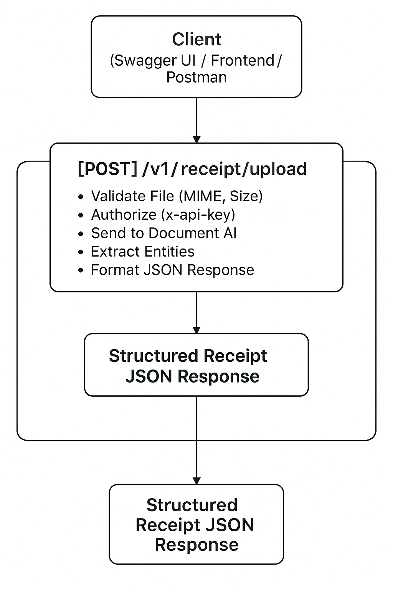

# System Architecture Overview

## Overview

This project is a backend service built with NestJS that provides an API for uploading receipt images and extracting structured receipt data using Google Cloud Document AI.

The extracted fields include supplier name, total amount, invoice date, and more.

---

## Components

| Component | Description |
|:---|:---|
| **NestJS Backend** | Handles API routing, file uploads, validation, error handling, and response formatting |
| **Google Document AI** | Processes uploaded receipt images/PDFs to extract structured data fields |
| **Swagger UI** | Provides an interactive documentation and testing interface |
| **Rate Limiting** | Protects API endpoints from abuse |
| **API Key Authentication** | Secures API access with `x-api-key` header |

---

## Data Flow

1. User uploads a receipt file through the `/v1/receipt/upload` API endpoint.
2. Backend validates the uploaded file for MIME type and size.
3. Backend sends the file data to Google Document AI using service account credentials.
4. Document AI processes the receipt and returns structured data (entities).
5. Backend formats the extracted fields into a clean camelCase JSON response.
6. API responds back to the client with structured receipt data.

---

## High-Level Diagram

---

## Authentication

- API endpoints require a valid `x-api-key` header.
- API Key value is validated against the environment variable configured in `.env`.

---

## Error Handling

- Invalid file types, missing API keys, and processing errors return structured error responses.
- Global exception filter captures unhandled errors and formats them nicely.

---

## Notes

- Only images (`jpeg`, `png`) and PDFs are allowed for upload.
- Rate limiting is applied globally to avoid service abuse.
- Environment variables are securely managed and excluded from source control.